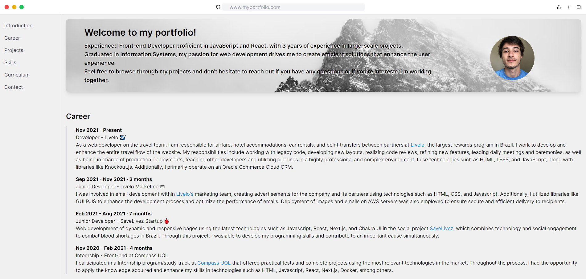

<h1> Portfolio 📄</h1>
<h2> V1 🛠</h2>

> Creating a portfolio 

A portfolio in a resume style, utilizing some of the most current technologies in the market, with functionalities to download the resume, view GitHub projects, and social networks.

## O que foi criado 
+ Home page
+ Hamburguer menu
+ Github projects redirect
+ Responsiveness
+ Deploy using vercel

## Tecnologias

+ Typescript
+ React
+ Next.js
+ Tailwind
+ Tailwind UI
+ Radix UI

## Página Piloto

https://rodgondin.vercel.app/
